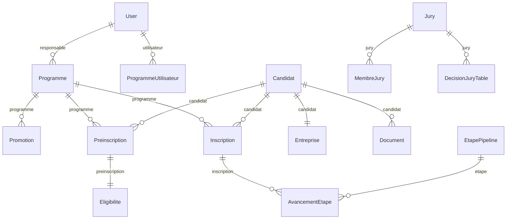

# SCHÉMA DE BASE DE DONNÉES - LIA WEB

Ce document détaille l'architecture complète de la base de données PostgreSQL de l'application LIA WEB, incluant les modèles, relations, enums et système de migration.

## Vue d'ensemble

L'application utilise **PostgreSQL** comme base de données principale avec **SQLModel** comme ORM moderne, offrant :
- **Modèles relationnels** : Entités métier avec relations complexes
- **Enums PostgreSQL** : Types personnalisés pour la validation
- **Migration automatique** : Système de migration intégré
- **Sécurité** : Contraintes d'intégrité et validation des données

---

## 1. ARCHITECTURE GÉNÉRALE

### Technologies Utilisées
- **Base de données** : PostgreSQL 13+
- **ORM** : SQLModel (basé sur SQLAlchemy)
- **Migration** : Service de migration personnalisé
- **Validation** : Pydantic + Enums PostgreSQL
- **Connexion** : Pool de connexions avec pré-ping

### Configuration
```python
# app/core/database.py
engine = create_engine(
    settings.DATABASE_URL,
    pool_pre_ping=True,
    echo=settings.DEBUG,
    connect_args={
        "options": "-c client_encoding=UTF8",
        "client_encoding": "utf8"
    }
)
```

---

## 2. MODÈLES PRINCIPAUX

### 2.1 Utilisateurs (`User`)

**Table** : `user`
**Description** : Utilisateurs du système avec gestion des rôles et permissions

```python
class User(SQLModel, table=True):
    id: Optional[int] = Field(default=None, primary_key=True)
    email: str = Field(unique=True, index=True)
    nom_complet: str
    telephone: Optional[str] = None
    mot_de_passe_hash: str
    role: str  # Valeur string de l'enum UserRole
    type_utilisateur: TypeUtilisateur = TypeUtilisateur.INTERNE
    actif: bool = True
    derniere_connexion: Optional[datetime] = None
    photo_profil: Optional[str] = None
    cree_le: datetime = Field(default_factory=lambda: datetime.now(timezone.utc))
```

**Relations** :
- `programmes_responsable` → `Programme` (One-to-Many)
- `programmes_utilisateurs` → `ProgrammeUtilisateur` (One-to-Many)
- `inscriptions_conseiller` → `Inscription` (One-to-Many)
- `inscriptions_referent` → `Inscription` (One-to-Many)
- `documents_deposes` → `Document` (One-to-Many)

### 2.2 Programmes (`Programme`)

**Table** : `programme`
**Description** : Programmes de coaching (ACD, ACI, ACT) avec objectifs et seuils

```python
class Programme(SQLModel, table=True):
    id: Optional[int] = Field(default=None, primary_key=True)
    code: str = Field(unique=True, index=True)  # "ACD", "ACI", "ACT"
    nom: str
    objectif: Optional[str] = None
    date_debut: Optional[date] = None
    date_fin: Optional[date] = None
    actif: bool = True
    responsable_id: Optional[int] = Field(foreign_key="user.id")
    
    # Objectifs
    objectif_total: Optional[int] = None
    cible_qpv_pct: Optional[float] = None
    cible_femmes_pct: Optional[float] = None
    
    # Seuils d'éligibilité
    ca_seuil_min: Optional[float] = None
    ca_seuil_max: Optional[float] = None
    anciennete_min_annees: Optional[int] = None
```

**Relations** :
- `responsable` → `User` (Many-to-One)
- `utilisateurs` → `ProgrammeUtilisateur` (One-to-Many)
- `promotions` → `Promotion` (One-to-Many)
- `preinscriptions` → `Preinscription` (One-to-Many)
- `inscriptions` → `Inscription` (One-to-Many)
- `etapes_pipeline` → `EtapePipeline` (One-to-Many)

### 2.3 Candidats (`Candidat`)

**Table** : `candidat`
**Description** : Candidats aux programmes avec informations personnelles et professionnelles

```python
class Candidat(SQLModel, table=True):
    id: Optional[int] = Field(default=None, primary_key=True)
    civilite: Optional[str] = None
    nom: str
    prenom: str
    email: str = Field(unique=True, index=True)
    telephone: Optional[str] = None
    date_naissance: Optional[date] = None
    adresse_personnelle: Optional[str] = None
    niveau_etudes: Optional[str] = None
    secteur_activite: Optional[str] = None
    handicap: bool = False
    photo_profil: Optional[str] = None
    lat: Optional[float] = None
    lng: Optional[float] = None
    statut: StatutCandidat = StatutCandidat.EN_ATTENTE
    cree_le: datetime = Field(default_factory=lambda: datetime.now(timezone.utc))
    modifie_le: Optional[datetime] = None
```

**Relations** :
- `entreprise` → `Entreprise` (One-to-One)
- `preinscriptions` → `Preinscription` (One-to-Many)
- `inscriptions` → `Inscription` (One-to-Many)
- `documents` → `Document` (One-to-Many)

### 2.4 Entreprises (`Entreprise`)

**Table** : `entreprise`
**Description** : Informations d'entreprise des candidats avec données SIRET

```python
class Entreprise(SQLModel, table=True):
    id: Optional[int] = Field(default=None, primary_key=True)
    candidat_id: int = Field(foreign_key="candidat.id", unique=True)
    siret: Optional[str] = None
    siren: Optional[str] = None
    raison_sociale: Optional[str] = None
    code_naf: Optional[str] = None
    date_creation: Optional[date] = None
    adresse: Optional[str] = None
    chiffre_affaires: Optional[str] = None
    nombre_points_vente: Optional[int] = None
    specialite_culinaire: Optional[str] = None
    nom_concept: Optional[str] = None
    site_internet: Optional[str] = None
    lien_reseaux_sociaux: Optional[str] = None
    qpv: bool = False
    lat: Optional[float] = None
    lng: Optional[float] = None
```

**Relations** :
- `candidat` → `Candidat` (One-to-One)

### 2.5 Préinscriptions (`Preinscription`)

**Table** : `preinscription`
**Description** : Demandes de préinscription avec statut et éligibilité

```python
class Preinscription(SQLModel, table=True):
    id: Optional[int] = Field(default=None, primary_key=True)
    candidat_id: int = Field(foreign_key="candidat.id")
    programme_id: int = Field(foreign_key="programme.id")
    statut: StatutDossier = StatutDossier.BROUILLON
    cree_le: datetime = Field(default_factory=lambda: datetime.now(timezone.utc))
    modifie_le: Optional[datetime] = None
```

**Relations** :
- `candidat` → `Candidat` (Many-to-One)
- `programme` → `Programme` (Many-to-One)
- `eligibilite` → `Eligibilite` (One-to-One)
- `inscription` → `Inscription` (One-to-One)

### 2.6 Inscriptions (`Inscription`)

**Table** : `inscription`
**Description** : Inscriptions validées avec conseiller et référent

```python
class Inscription(SQLModel, table=True):
    id: Optional[int] = Field(default=None, primary_key=True)
    candidat_id: int = Field(foreign_key="candidat.id")
    programme_id: int = Field(foreign_key="programme.id")
    promotion_id: Optional[int] = Field(foreign_key="promotion.id")
    conseiller_id: Optional[int] = Field(foreign_key="user.id")
    referent_id: Optional[int] = Field(foreign_key="user.id")
    statut: StatutDossier = StatutDossier.EN_EXAMEN
    cree_le: datetime = Field(default_factory=lambda: datetime.now(timezone.utc))
    modifie_le: Optional[datetime] = None
```

**Relations** :
- `candidat` → `Candidat` (Many-to-One)
- `programme` → `Programme` (Many-to-One)
- `promotion` → `Promotion` (Many-to-One)
- `conseiller` → `User` (Many-to-One)
- `referent` → `User` (Many-to-One)
- `avancements` → `AvancementEtape` (One-to-Many)

---

## 3. MODÈLES DE GESTION

### 3.1 Documents (`Document`)

**Table** : `document`
**Description** : Gestion des documents uploadés par les candidats

```python
class Document(SQLModel, table=True):
    id: Optional[int] = Field(default=None, primary_key=True)
    candidat_id: int = Field(foreign_key="candidat.id")
    nom_fichier: str
    chemin_fichier: str
    taille_octets: int
    type_document: TypeDocument
    description: Optional[str] = None
    depose_le: datetime = Field(default_factory=lambda: datetime.now(timezone.utc))
    depose_par_id: Optional[int] = Field(foreign_key="user.id")
```

### 3.2 Éligibilité (`Eligibilite`)

**Table** : `eligibilite`
**Description** : Évaluation de l'éligibilité des candidats

```python
class Eligibilite(SQLModel, table=True):
    id: Optional[int] = Field(default=None, primary_key=True)
    preinscription_id: int = Field(foreign_key="preinscription.id", unique=True)
    ca_seuil_ok: Optional[bool] = None
    ca_score: Optional[float] = None
    qpv_ok: Optional[bool] = None
    anciennete_ok: Optional[bool] = None
    anciennete_annees: Optional[int] = None
    verdict: Optional[str] = None
    details_json: Optional[str] = None
    cree_le: datetime = Field(default_factory=lambda: datetime.now(timezone.utc))
```

### 3.3 Pipeline (`EtapePipeline` / `AvancementEtape`)

**Tables** : `etapepipeline`, `avancementetape`
**Description** : Gestion du pipeline de traitement des candidatures

```python
class EtapePipeline(SQLModel, table=True):
    id: Optional[int] = Field(default=None, primary_key=True)
    programme_id: int = Field(foreign_key="programme.id")
    nom: str
    description: Optional[str] = None
    ordre: int
    active: bool = True

class AvancementEtape(SQLModel, table=True):
    id: Optional[int] = Field(default=None, primary_key=True)
    inscription_id: int = Field(foreign_key="inscription.id")
    etape_id: int = Field(foreign_key="etapepipeline.id")
    statut: StatutEtape = StatutEtape.A_FAIRE
    debut_le: Optional[datetime] = None
    termine_le: Optional[datetime] = None
```

### 3.4 Jury (`Jury` / `MembreJury` / `DecisionJuryTable`)

**Tables** : `jury`, `membrejury`, `decisionjurytable`
**Description** : Gestion des jurys et décisions

```python
class Jury(SQLModel, table=True):
    id: Optional[int] = Field(default=None, primary_key=True)
    programme_id: int = Field(foreign_key="programme.id")
    nom: str
    session_le: datetime
    decision: DecisionJury = DecisionJury.EN_ATTENTE
    commentaires: Optional[str] = None

class MembreJury(SQLModel, table=True):
    id: Optional[int] = Field(default=None, primary_key=True)
    jury_id: int = Field(foreign_key="jury.id")
    utilisateur_id: int = Field(foreign_key="user.id")
    role: str  # "president", "membre", "secretaire"

class DecisionJuryTable(SQLModel, table=True):
    id: Optional[int] = Field(default=None, primary_key=True)
    jury_id: int = Field(foreign_key="jury.id")
    candidat_id: int = Field(foreign_key="candidat.id")
    decision: DecisionJury
    commentaires: Optional[str] = None
    date_decision: datetime = Field(default_factory=lambda: datetime.now(timezone.utc))
```

---

## 4. ENUMS POSTGRESQL

### 4.1 Rôles Utilisateurs (`UserRole`)

```python
class UserRole(str, Enum):
    DIRECTEUR_GENERAL = "directeur_general"
    DIRECTEUR_TECHNIQUE = "directeur_technique"
    RESPONSABLE_PROGRAMME = "responsable_programme"
    CONSEILLER = "conseiller"
    COORDINATEUR = "coordinateur"
    FORMATEUR = "formateur"
    EVALUATEUR = "evaluateur"
    ACCOMPAGNATEUR = "accompagnateur"
    ADMINISTRATEUR = "administrateur"
    DRH = "drh"
    RESPONSABLE_STRUCTURE = "responsable_structure"
    COACH_EXTERNE = "coach_externe"
    JURY_EXTERNE = "jury_externe"
    CANDIDAT = "candidat"
    RESPONSABLE_COMMUNICATION = "responsable_communication"
    ASSISTANT_COMMUNICATION = "assistant_communication"
```

### 4.2 Statuts de Dossier (`StatutDossier`)

```python
class StatutDossier(str, Enum):
    BROUILLON = "brouillon"
    SOUMIS = "soumis"
    EN_EXAMEN = "en_examen"
    A_COMPLETER = "a_completer"
    VALIDE = "valide"
    EN_ATTENTE = "en_attente"
    REORIENTE = "reoriente"
    REFUSE = "refuse"
    CLOTURE = "cloture"
```

### 4.3 Types de Documents (`TypeDocument`)

```python
class TypeDocument(str, Enum):
    CV = "cv"
    LETTRE_MOTIVATION = "lettre_motivation"
    PIECE_IDENTITE = "piece_identite"
    JUSTIFICATIF_DOMICILE = "justificatif_domicile"
    K_BIS = "k_bis"
    BILAN_COMPTABLE = "bilan_comptable"
    AUTRE = "autre"
```

### 4.4 Décisions de Jury (`DecisionJury`)

```python
class DecisionJury(str, Enum):
    VALIDE = "VALIDE"
    REORIENTE = "REORIENTE"
    REJETE = "REJETE"
    EN_ATTENTE = "EN_ATTENTE"
```

### 4.5 Statuts d'Étape (`StatutEtape`)

```python
class StatutEtape(str, Enum):
    A_FAIRE = "a_faire"
    EN_COURS = "en_cours"
    TERMINE = "termine"
    IGNORE = "ignore"
```

---

## 5. SYSTÈME DE MIGRATION

### 5.1 Service de Migration (`DatabaseMigrationService`)

**Fichier** : `app/services/database_migration.py`
**Description** : Service automatique de migration de la base de données

#### Fonctionnalités Principales

1. **Migration des Enums**
   ```python
   def _migrate_enums(self, results: Dict[str, Any]):
       """Migre les enums PostgreSQL"""
       enum_mappings = {
           'typedocument': {'values': [e.value for e in TypeDocument]},
           'userrole': {'values': [e.value for e in UserRole]},
           'statutpresence': {'values': [e.value for e in StatutPresence]},
           'typeutilisateur': {'values': [e.value for e in TypeUtilisateur]},
           'statutdossier': {'values': [e.value for e in StatutDossier]},
           'decisionjury': {'values': [e.value for e in DecisionJury]}
       }
   ```

2. **Vérification des Tables**
   ```python
   def _migrate_tables(self, results: Dict[str, Any]):
       """Migre les tables (création si nécessaire)"""
       critical_tables = ['user', 'programme', 'candidat', 'document', 'preinscription']
   ```

3. **Vérification des Colonnes**
   ```python
   def _migrate_columns(self, results: Dict[str, Any]):
       """Migre les colonnes (ajout si nécessaire)"""
       critical_columns = {
           'user': ['role', 'type_utilisateur', 'actif'],
           'programme': ['statut'],
           'document': ['type_document'],
           'preinscription': ['statut'],
           'jury': ['decision']
       }
   ```

#### Processus de Migration

1. **Vérification de l'existence des enums**
2. **Création des enums manquants**
3. **Ajout des valeurs manquantes aux enums existants**
4. **Vérification de l'existence des tables critiques**
5. **Vérification de l'existence des colonnes critiques**
6. **Rapport détaillé des opérations effectuées**

### 5.2 Statut de la Base de Données

**Méthode** : `get_database_status()`
**Retour** : Dictionnaire avec le statut complet

```python
{
    "enums": {
        "typedocument": ["cv", "lettre_motivation", "piece_identite", ...],
        "userrole": ["directeur_general", "conseiller", "administrateur", ...],
        "statutdossier": ["brouillon", "soumis", "en_examen", ...]
    },
    "tables": ["user", "programme", "candidat", "document", ...],
    "connection": True
}
```

---

## 6. RELATIONS ET CONTRAINTES

### 6.1 Relations Principales



### 6.2 Contraintes d'Intégrité

- **Clés primaires** : Tous les modèles ont un `id` auto-incrémenté
- **Clés étrangères** : Relations avec `foreign_key` explicite
- **Unicité** : Email unique pour `User` et `Candidat`
- **Index** : Index sur les champs fréquemment recherchés
- **Contraintes de domaine** : Validation via les enums PostgreSQL

### 6.3 Contraintes Métier

- **Un candidat** ne peut avoir qu'**une entreprise**
- **Une préinscription** ne peut avoir qu'**une éligibilité**
- **Un programme** doit avoir un **responsable**
- **Une inscription** doit avoir un **conseiller** et un **référent**
- **Les documents** sont liés à un **candidat** spécifique

---

## 7. PERFORMANCE ET OPTIMISATION

### 7.1 Index Créés

```sql
-- Index sur les champs de recherche fréquents
CREATE INDEX idx_user_email ON user(email);
CREATE INDEX idx_candidat_email ON candidat(email);
CREATE INDEX idx_programme_code ON programme(code);
CREATE INDEX idx_preinscription_programme ON preinscription(programme_id);
CREATE INDEX idx_inscription_candidat ON inscription(candidat_id);
```

### 7.2 Stratégies de Requêtes

- **Eager Loading** : Utilisation de `joinedload` pour les relations
- **Lazy Loading** : Chargement à la demande pour les relations optionnelles
- **Pagination** : Limitation des résultats pour les listes importantes
- **Filtrage** : Index sur les champs de filtrage fréquents

### 7.3 Pool de Connexions

```python
engine = create_engine(
    settings.DATABASE_URL,
    pool_pre_ping=True,  # Vérification de la connexion avant utilisation
    echo=settings.DEBUG,  # Log des requêtes SQL en mode debug
    connect_args={
        "options": "-c client_encoding=UTF8",
        "client_encoding": "utf8"
    }
)
```

---

## 8. SÉCURITÉ ET VALIDATION

### 8.1 Validation des Données

- **Pydantic** : Validation des schémas d'entrée
- **SQLModel** : Validation des types au niveau ORM
- **Enums PostgreSQL** : Contraintes au niveau base de données
- **Contraintes de domaine** : Validation métier dans les services

### 8.2 Sécurité des Données

- **Hachage des mots de passe** : bcrypt avec salt
- **Encodage UTF-8** : Support complet des caractères internationaux
- **Validation des entrées** : Protection contre les injections SQL
- **Contraintes d'intégrité** : Prévention des données incohérentes

### 8.3 Audit et Traçabilité

- **Timestamps automatiques** : `cree_le`, `modifie_le`
- **Logs d'activité** : Traçabilité des actions utilisateur
- **Versioning** : Historique des modifications importantes
- **Sauvegarde** : Système d'archivage intégré

---

## 9. MAINTENANCE ET ÉVOLUTION

### 9.1 Ajout de Nouveaux Modèles

1. **Définir le modèle** dans `app/models/base.py`
2. **Ajouter les relations** avec `Relationship()`
3. **Créer les enums** si nécessaire dans `app/models/enums.py`
4. **Mettre à jour la migration** dans `DatabaseMigrationService`
5. **Tester la migration** sur un environnement de développement

### 9.2 Modification des Modèles Existants

1. **Ajouter les nouveaux champs** avec `Optional` pour la compatibilité
2. **Mettre à jour la migration** pour ajouter les colonnes
3. **Tester la migration** sur des données existantes
4. **Déployer en production** avec un plan de rollback

### 9.3 Surveillance et Monitoring

- **Logs de migration** : Suivi des opérations de migration
- **Statut de la base** : Vérification régulière de l'intégrité
- **Performance** : Monitoring des requêtes lentes
- **Espace disque** : Surveillance de la croissance des données

---

*Document généré automatiquement - Schéma de base de données LIA WEB*
