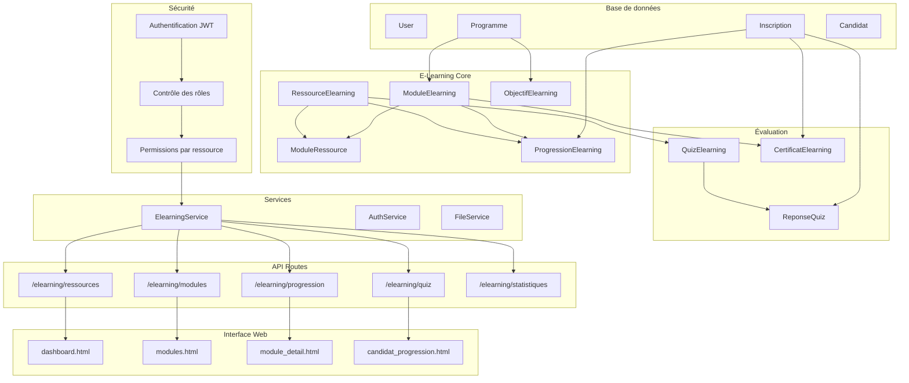

# Architecture du Système E-Learning



## Flux de données

### 1. Création de contenu
```
Formateur → ElearningService → RessourceElearning → ModuleElearning
```

### 2. Apprentissage candidat
```
Candidat → ProgressionElearning → RessourceElearning → QuizElearning
```

### 3. Évaluation
```
QuizElearning → ReponseQuiz → Score → CertificatElearning
```

### 4. Statistiques
```
ProgressionElearning → ElearningService → Statistiques → Dashboard
```

## Types de ressources

- **Vidéo** : Cours en ligne, tutoriels
- **Document** : PDF, présentations, guides
- **Quiz** : Évaluations interactives
- **Lien** : Ressources externes
- **Audio** : Podcasts, enregistrements

## États de progression

- **non_commence** : Ressource pas encore commencée
- **en_cours** : Ressource en cours de consultation
- **termine** : Ressource terminée avec succès
- **abandonne** : Ressource abandonnée

## Rôles et permissions

- **Administrateur** : Accès complet au système
- **Responsable Programme** : Gestion des modules de son programme
- **Formateur** : Création de ressources pédagogiques
- **Candidat** : Accès à ses modules et progression
